# HiRes Processing Pipeline

**Version 0.1 – DRAFT, May 2026**

> 🚧 **Coming soon** — the formal HiRes processing pipeline documentation is
> still in development. In the meantime, see the
> [Processing Pipelines](../GryfnProcessingPipeline/Gryfn_Processing_Pipeline.md)
> overview and the
> [HiRes Fieldbook](../../Sensors/HIRES/HIRES_FieldBook.md) for sensor-side
> context.

> [!CAUTION]
> **AI-generated scaffold — content not validated.**
> The structure and prose in the sections below were
> scaffolded using Claude Opus to outline the intended shape of
> the document. The technical content (toolchain details, step sequences,
> parameter names, output filenames, etc.) has **not** been reviewed or
> verified against the actual APPN HiRes processing workflow and should be
> treated as a placeholder only. Do **not** rely on this content for
> processing until it has been replaced with verified, operator-authored
> instructions.

> [!IMPORTANT]
> This page documents the **standardised GRYFN processing pipelines** used
> within APPN for UAV-based data processing, intended for trained APPN staff
> processing CALViS, GOBI, HiRes, and M3M datasets. Adherence to the
> pipelines below ensures reproducibility, quality assurance, and
> cross-project comparability. For any processing run that **deviates from
> the standard pipeline**, detailed records must be kept of every parameter
> changed, the rationale, and any anticipated implications for data quality.

This page documents the standardised HiRES (PhaseOne) processing pipeline
within APPN for UAV-based data processing. These configurations define
consistent, transparent, and repeatable processing workflows across
GRYFN-supported sensors and platforms, supporting reproducibility, quality
assurance, and cross-project comparability. The files are intended to be used
as reference and default templates for approved processing pipelines, with any
deviations explicitly documented to maintain traceability and data integrity.

The standard pipelines and the data products they output are detailed below.
For a tabular summary of output formats, resolutions and software
compatibility, see
[Standard Data Products](../../Background/StandardDataProducts/Standard_Data_Products.md).

> [!IMPORTANT]
> **Document status — work in progress.**
> This page is a draft and requires further revision before it can be
> considered final.

---

## Document Structure

- [Processing methods](#processing-methods)
  - [Method 1 — PhaseOne iX Capture (Windows GUI)](#method-1--phaseone-ix-capture-windows-gui)
  - [Method 2 — PhaseOne Image SDK (Linux CLI / shell scripts)](#method-2--phaseone-image-sdk-linux-cli--shell-scripts)
  - [Method 3 — Display-focused orthomosaic](#method-3--display-focused-orthomosaic)

---

## Processing methods

APPN currently supports **three** processing pathways for HiRes (PhaseOne)
data. The first two pathways produce the standard, radiometrically and
geometrically rigorous APPN data products and are based on the
[PhaseOne iX Capture / Image SDK](https://geospatial.phaseone.com/) toolchain.
The third pathway is a lightweight, display-focused orthomosaic intended for
rapid visualisation, QA previews, and stakeholder engagement — it is **not**
suitable for quantitative analysis.

| # | Method | Toolchain | Operating system | Primary output | Use case |
|---|--------|-----------|------------------|----------------|----------|
| 1 | iX Capture GUI | PhaseOne iX Capture (GUI) | Windows | Calibrated RGB frames + standard APPN orthomosaic | Default operator-driven processing |
| 2 | Image SDK CLI | PhaseOne Image SDK + shell scripts | Linux | Calibrated RGB frames + standard APPN orthomosaic | Batch / HPC / reproducible processing |
| 3 | Display orthomosaic | Lightweight photogrammetry (e.g. Metashape / ODM) | Windows or Linux | Visually optimised RGB orthomosaic (GeoTIFF / COG) | Quick-look previews, comms, QA |

> [!NOTE]
> Methods 1 and 2 are **functionally equivalent** — they apply the same
> radiometric calibration, lens correction, and geometric model from the
> PhaseOne Image SDK, and should produce numerically comparable outputs.
> Method 3 is **separate** and produces a visually pleasing product
> at the cost of some mosaicing artefects and lower resolution.  

---

### Method 1 — PhaseOne iX Capture (Windows GUI)

> 🚧 **Coming soon** — full step-by-step instructions to be added.

**Toolchain.** PhaseOne **iX Capture** (Windows desktop GUI), built on the
PhaseOne Image SDK.

**When to use.** This is the **default** processing pathway for routine
operator-driven HiRes processing where a workstation with the iX Capture
licence is available.

**Inputs.**

- Raw PhaseOne `.IIQ` frames from the HiRes sensor.
- Camera calibration / LCC files supplied with the sensor.
- Flight log / event marks (for georeferencing).
- RTK / PPK trajectory (where available).

**Outline of steps.**

1. Ingest the raw `.IIQ` frames into iX Capture.
2. Apply the supplied PhaseOne **camera calibration** profile.
3. Apply **LCC (Light Calibration / flat-field) correction**.
4. Apply lens distortion correction and geometric model.
5. Export calibrated, georeferenced frames (GeoTIFF / DNG) to be passed to
   the orthomosaic stage.
6. Generate the standard APPN orthomosaic from the calibrated frames.

**Outputs.**

- Calibrated per-frame imagery.
- `RGB_Orthomosaic.tif` (GeoTIFF, 0.6 cm fixed GSD — see
  [Standard Data Products](../../Background/StandardDataProducts/Standard_Data_Products.md)).
- Processing report / log.

**TODO.**

- Document iX Capture version pinned for APPN processing.
- Document exact GUI parameter presets and screenshots.
- Document export settings for handover to the orthomosaic stage.

> [!NOTE]
> 🖼️ **Images needed (screenshots):**
>
> - iX Capture GUI showing the camera-calibration profile being
>   loaded / applied.
> - LCC (Light Calibration / flat-field) correction step in the GUI.
> - Export-settings dialog for calibrated GeoTIFF / DNG frame output.

---

### Method 2 — PhaseOne Image SDK (Linux CLI / shell scripts)

> 🚧 **Coming soon** — full step-by-step instructions and reference scripts
> to be added.

**Toolchain.** PhaseOne **Image SDK** invoked from shell scripts on Linux.
This produces outputs that are equivalent to Method 1 but is suitable for
**batch processing, headless servers, and HPC**, and is the preferred path
for reproducible processing runs.

**When to use.**

- Large backlogs / batch reprocessing.
- Headless / HPC environments without a Windows GUI.
- Where strict reproducibility (scripted, version-controlled parameters) is
  required.

**Inputs.** Same as Method 1.

**Outline of steps.**

1. Stage raw `.IIQ` frames and calibration files in the expected
   [data folder structure](../../DataManagement/DataFolderStructure/DataFolderStructure.md).
2. Run the APPN HiRes shell pipeline, which wraps the PhaseOne Image SDK
   CLI to:
   1. Apply the camera calibration profile.
   2. Apply LCC / flat-field correction.
   3. Apply lens distortion and geometric correction.
   4. Export calibrated GeoTIFF / DNG frames.
3. Pass the calibrated frames to the orthomosaic stage.
4. Emit a machine-readable processing report (parameters, versions, run
   time, checksums).

**Outputs.** Same as Method 1, plus a structured processing log.

**TODO.**

- Document Image SDK version pinned for APPN processing.
- Add reference shell pipeline (location in repo, invocation, env vars).
- Document parity checks against Method 1 (numerical equivalence tests).
- Document container / environment (Conda / Docker) used for runs.

> [!NOTE]
> 🖼️ **Images needed (screenshots):**
>
> - Terminal screenshot showing the reference shell-pipeline
>   invocation (env vars, command line, expected log output).
> - Sample structured processing report (parameters, versions, run
>   time, checksums) rendered for the docs.

---

### Method 3 — Display-focused orthomosaic

> 🚧 **Coming soon** — full step-by-step instructions to be added.

**Toolchain.** Lightweight photogrammetry suite (e.g. Agisoft Metashape,
OpenDroneMap, or equivalent) — **not** the PhaseOne Image SDK.

**When to use.** Rapid, visually optimised orthomosaics for:

- In-field / same-day quick-look previews.
- Stakeholder communication, reports, and presentation graphics.
- QA of flight coverage and gross georeferencing before committing to the
  full Method 1 / Method 2 pipeline.

> [!WARNING]
> Method 3 outputs are **display-only**. They are **not** radiometrically
> calibrated, do **not** carry the standard APPN per-band reflectance
> properties, and **must not** be used for quantitative analysis,
> reflectance retrieval, or downstream spectral / trait modelling.

**Inputs.**

- Raw or quickly-developed RGB JPEGs / TIFFs from the HiRes frames.
- Flight log / image GPS tags.

**Outline of steps.**

1. Develop / export RGB previews from the raw `.IIQ` frames (default
   profile, no rigorous calibration required).
2. Load frames into the chosen photogrammetry tool.
3. Run alignment, dense cloud / depth maps (optional), and orthomosaic
   generation with display-oriented presets (visual colour balancing
   permitted).
4. Export as GeoTIFF / Cloud Optimized GeoTIFF for web / GIS preview.

**Outputs.**

- `RGB_Display_Orthomosaic.tif` (GeoTIFF / COG, visually optimised,
  uncalibrated). Filename and folder convention to be confirmed.

**TODO.**

- Confirm preferred photogrammetry tool and version.
- Document filename / folder convention so display products are clearly
  distinguishable from the standard `RGB_Orthomosaic.tif`.
- Document required watermark / metadata flag marking the product as
  "display only — not for quantitative use".

### Processing a HiRes flight in Agisoft Metashape. 

#### NOTE: This is just a placeholder processing workflow so those new to HiRes can get a feel for the data and Agisoft. It is not perfect and its not a one size fits all approach. The APPN uniform approach has not been confirmed as of yet. - Richard Harwood 

#### Step 1 — Locate the processed JPEGs

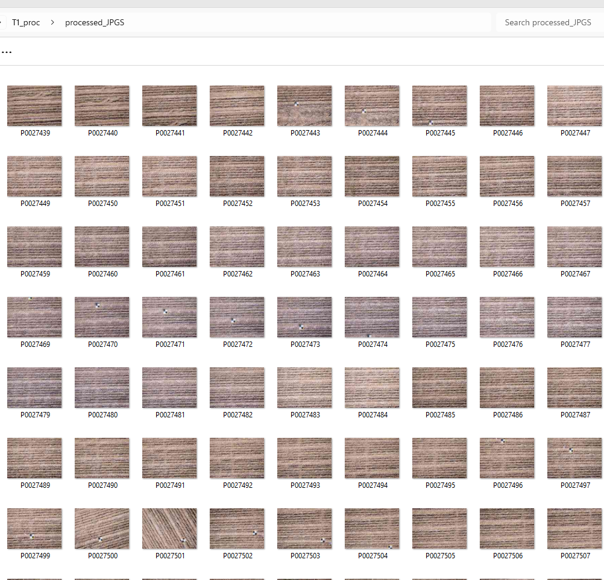

Start with a folder of the processed HiRes JPEG frames ready for import.

#### Step 2 — Prepare the AeroPoints / GCP file

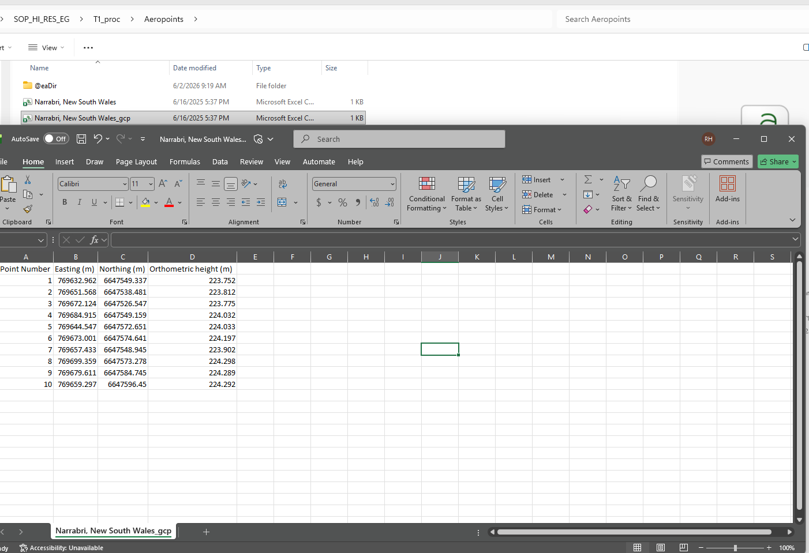

Format the AeroPoints (ground control points) into the layout Metashape
expects — label, easting/northing (or lat/lon), and elevation.

#### Step 3 — Load the JPEGs into Agisoft

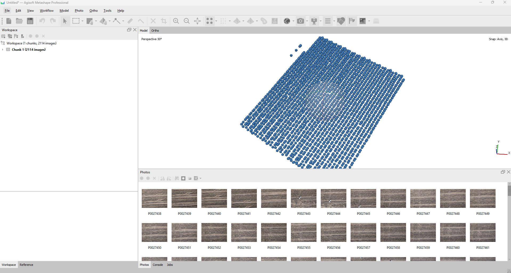

Drag and drop (or **Add Photos**) the processed JPEGs into the Metashape
chunk so the images appear in the workspace.

#### Step 4 — Set / convert the coordinate reference system

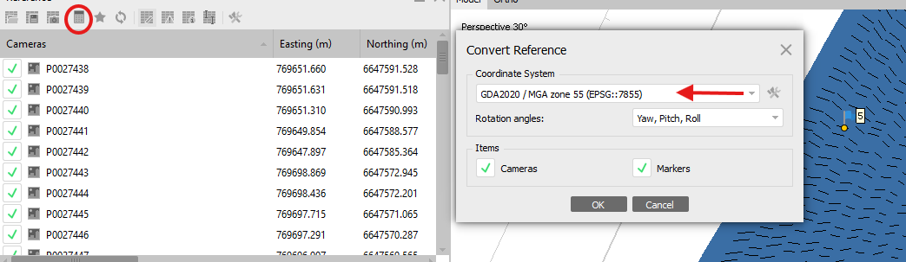

Set the camera CRS and convert it to the project's target CRS so the imagery
and control points share the same coordinate system.

#### Step 5 — Import the AeroPoints

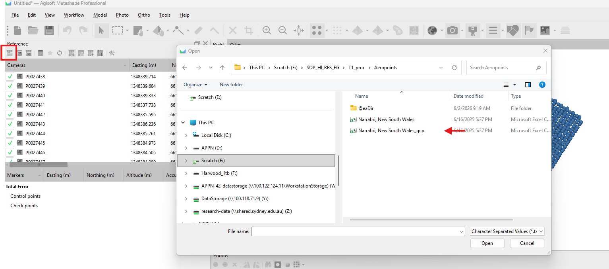

Import the formatted AeroPoints file as markers/GCPs, mapping the columns to
the correct coordinate fields.

#### Step 6 — Check the imported AeroPoints

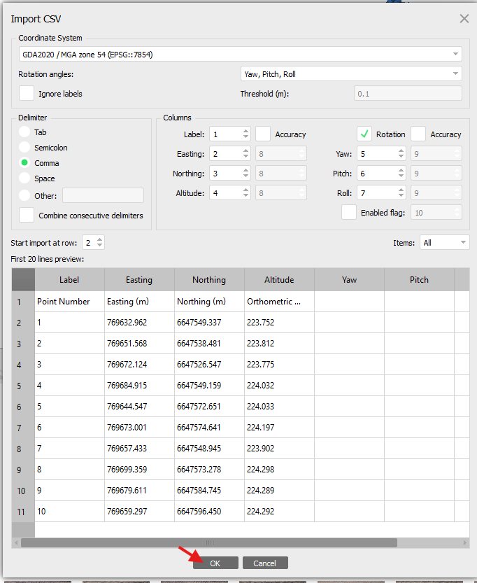

Verify the markers loaded correctly and sit in sensible positions relative to
the camera locations.

#### Step 7 — Hit "Yes to all"

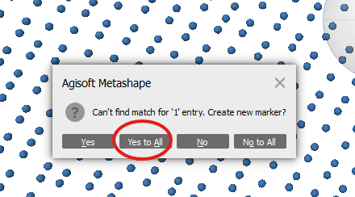

#### Step 8 — Set up Align photos

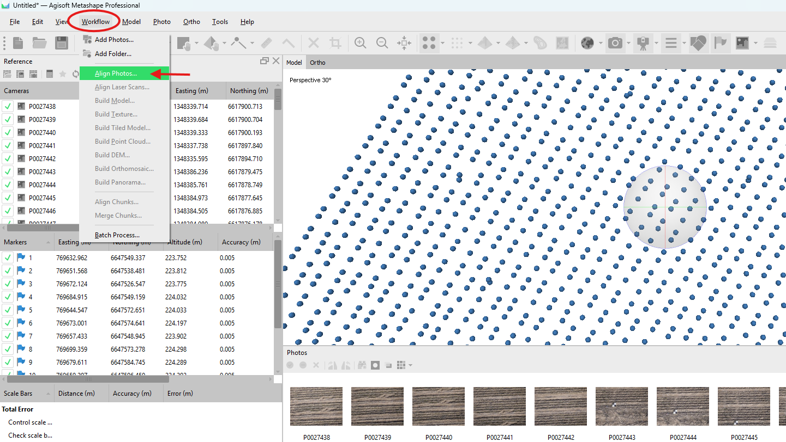

Run **Align Photos** to estimate camera positions and build the sparse point
cloud.

#### Step 9 — Run Alignment 

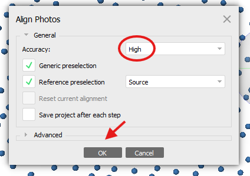

#### Step 10 — Load a marker

Select a marker (GCP) to begin refining its position across the images. Select filter photos by marker to see which images contain the marker.  

#### Step 11 — Inspect the distance from the aeropoint to the centre of the GCP
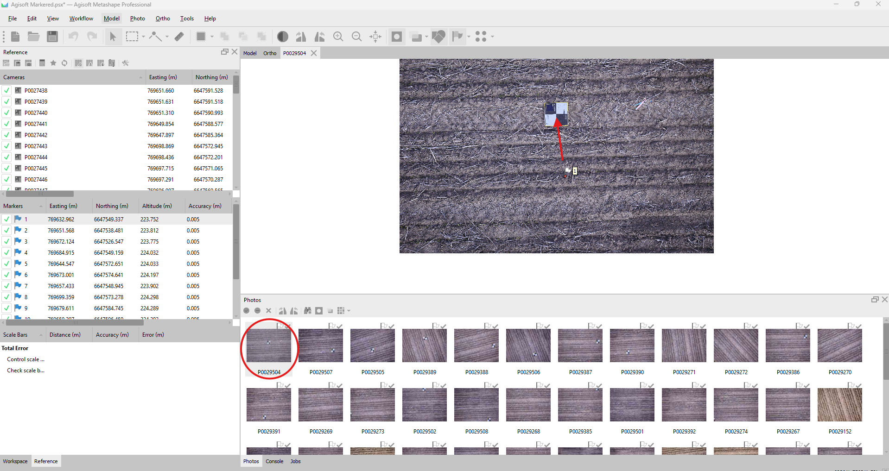

#### Step 12 — Move the marker

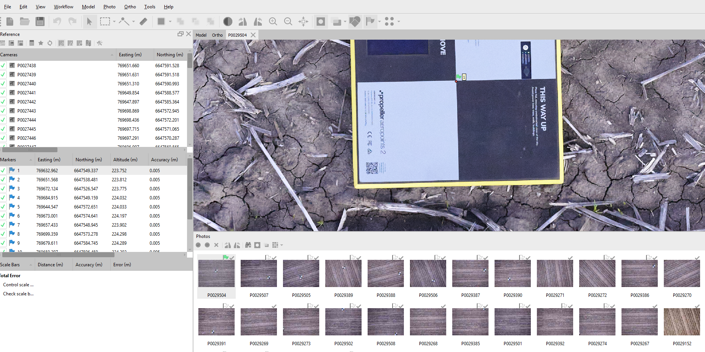

Drag the marker to its precise location on the ground control target in the
image.

#### Step 13 — Repeat across images and markers

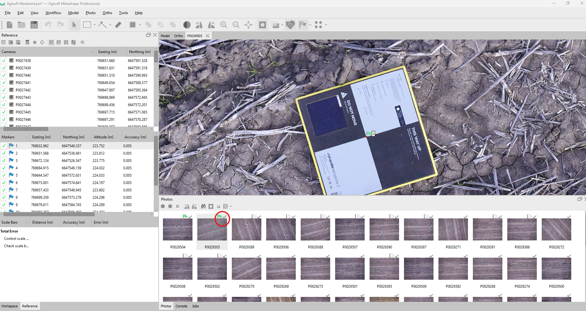

Repeat the marker placement on the remaining images so each GCP is accurately
pinned across all views. Note that you should do ~ 5 images fro a GCP/Marker. Essentially repeat the process until the point is consistently falling in the middle of the GCP for a given marker. 

#### Step 14 — Optimise cameras

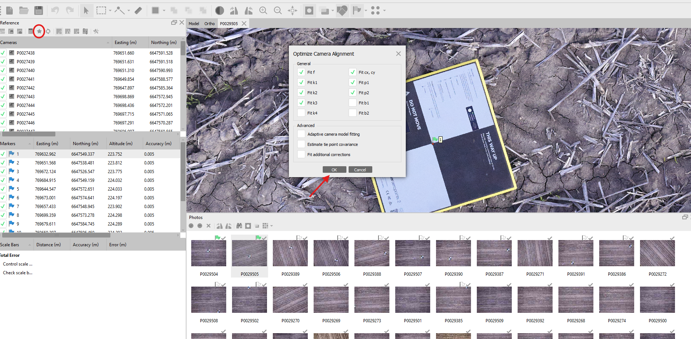

Run **Optimise Cameras** 

#### Step 15 — Build point cloud

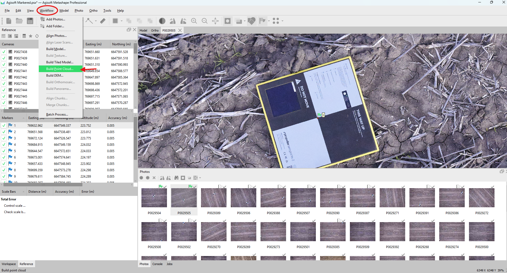

Start **Build Point Cloud** to generate the dense point cloud from the aligned
imagery.

#### Step 16 — Point cloud settings

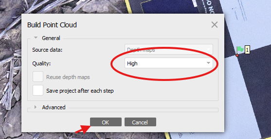

Set the quality and depth-filtering options, then run the dense point cloud
build.

#### Step 17 — Build DEM

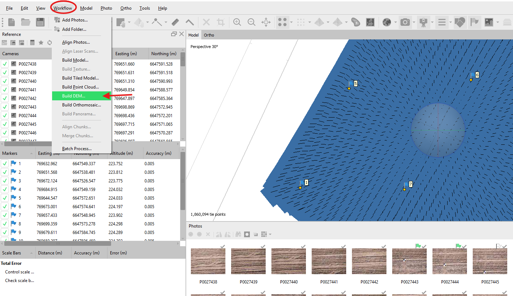

Start **Build DEM** to generate the digital elevation model from the point
cloud.

#### Step 18 — DEM settings

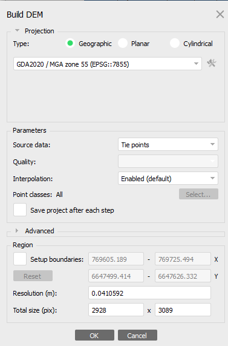

Confirm the source data, projection, and resolution, then run the DEM build.

#### Step 19 — Build orthomosaic

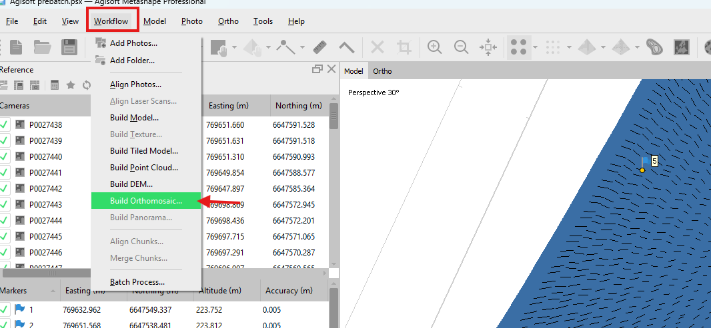

Start **Build Orthomosaic** to generate the orthorectified mosaic from the
imagery and DEM.

#### Step 20 — Orthomosaic settings

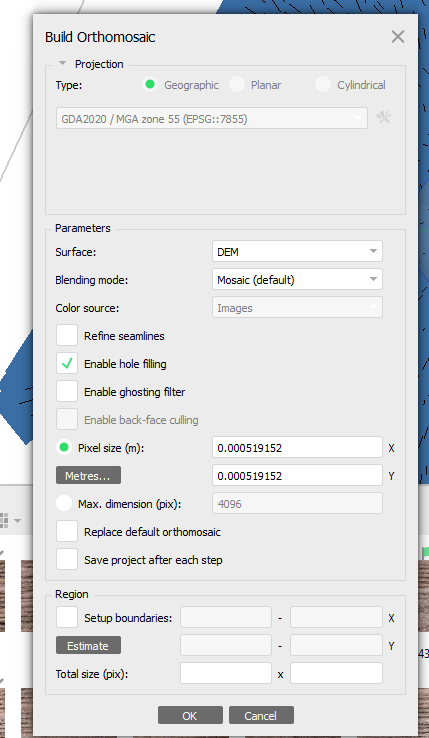

Set the surface (DEM), blending mode, and resolution, then run the
orthomosaic build.

#### Step 21 — View the orthomosaic

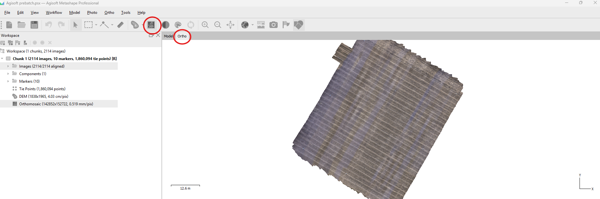

Inspect the finished orthomosaic for coverage, colour balance, and any
mosaicing artefacts.

#### Step 22 — Export the orthomosaic

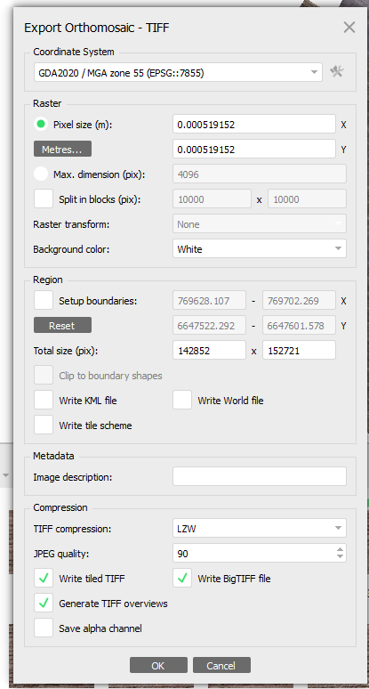

Export the orthomosaic as a GeoTIFF, confirming the CRS, resolution, and
output path.

