# APPN – Plot Delineation

This protocol defines the APPN standard for plot delineation shapefiles —
their structure, attributes, and storage location within the APPN folder
hierarchy — and documents the supported methods for producing them from
APPN aerial imagery (typically RGB orthomosaics captured by GRYFN UAV
systems). Consistent plot delineation underpins repeatable phenotypic
analysis across APPN trials.

> [!IMPORTANT]
> The APPN plot shapefile specification below must be followed for all
> trials, regardless of which method is used to generate the shapefile.
> For any deviations from this specification or these methods (e.g.
> alternative tools, non-standard plot layouts), keep detailed records of
> the changes made, the rationale, and any implications for downstream
> analysis.

---

> [!IMPORTANT]
> **Document status — methods under cross-validation.**
> The APPN plot delineation standard and the three supported methods
> below reflect the decisions made at the **APPN Field EWG
> plot-delineation meeting**. **Zeljana Grbovic** is currently testing
> whether all three methods
> ([FIELDimageR](#method-1-fieldimager-qgis),
> [DPIRD Field Mapping Tool](#method-2-dpird-field-mapping-tool), and
> [GPT plot creation tool](#method-3-gpt-plot-creation-tool)) produce
> consistent results. Parts of this protocol may change depending on
> the outcome of that testing, which is tracked in the
> [future-release backlog](../../../TODO_FUTURE.md).

---

## Document Structure

This protocol is organised so you can read it top-to-bottom for the full
APPN plot delineation standard, or jump straight to the section you need.
Decisions made at the **APPN Field EWG plot-delineation meeting** are
reflected inline; outstanding follow-ups are flagged in the
[Outstanding TODOs](#document-status--work-in-progress) at the top.

- [APPN Plot Delineation](#appn-plot-delineation) — rationale and the
  competing sources of error a standard delineation approach must manage.
  - [Recommended Buffer](#recommended-buffer) — minimum inward buffer
    values, real-world worked examples, and when to deviate.
- [APPN Plot Shapefile Standard](#appn-plot-shapefile-standard) — the
  mandatory file format, attributes, storage location, and naming
  convention every plot layout file must follow.
  - [File format](#file-format) — **GeoJSON ratified as the primary
    format**; shapefile retained as legacy / companion only.
  - [Required attributes](#required-attributes) — the ratified minimum
    set (`fid`, `plot_id`, `row`, `range`, `crop`) plus optional
    columns (`is_buffer`, `block`, etc.).
  - [Storage location](#storage-location) — confirmed as
    `Documentation/Plot_Layout/`.
  - [File naming convention](#file-naming-convention) — sensor tag in
    the file name (e.g. `CALVIS`, `GOBI`, `HIRES`, `M3M`).
- [Joining Trial Information](#joining-trial-information) — how trial
  metadata is attached to the plot geometry via `plot_id`.
- [Methods](#methods) — supported procedures for generating an
  APPN-compliant plot layout file.
  - [Method 1: FIELDimageR (QGIS)](#method-1-fieldimager-qgis)
  - [Method 2: DPIRD Field Mapping Tool](#method-2-dpird-field-mapping-tool)
  - [Method 3: GPT plot creation tool](#method-3-gpt-plot-creation-tool)

---

> [!IMPORTANT]
> **Summary — the one mandatory plot file.**
> Every APPN field site **must** have a single main plot file:
>
> - **Filename:** `{YYYYSiteName}_plots.geojson`
> - **Location:** `{Node}/{YYYY_ProjectDesc[_I|E][_Researcher][_org]}/{YYYYSiteName[_F|C]}/Documentation/Plot_Layout/`
> - **Example:** `USYD_Narrabri/2025_SIFOzBarley/2025IAWatson_F/Documentation/Plot_Layout/2025IAWatson_plots.geojson`
>
> This file is the entry point every downstream pipeline depends on.
> It **must** carry the mandatory standard attributes described in
> [Required attributes](#required-attributes). All other files
> (`plots_*` variants, `sampling_*`, `gcp`) are optional. See
> [Storage location](#storage-location) and
> [File naming convention](#file-naming-convention) for details.

---


## APPN Plot Delineation

A standard APPN plot delineation approach ensures that comparable trials can
be analysed consistently across nodes. The goal is to maximise the usable
plot area sampled by the aerial data while minimising two competing sources
of error:

- **Edge effects** — agronomic and radiometric contamination from
  neighbouring plots, alleys, and bare soil at plot boundaries.
- **Positional uncertainty** — small misalignments between the plot
  shapefile and the orthomosaic caused by GNSS/RTK error, orthorectification
  residuals, and sowing/layout drift (rows bowing or skewing relative to
  the design grid as the seeder tracks across the trial).

In practice, this is achieved by applying a consistent inward **buffer** to
each plot polygon so the analysed region sits comfortably inside the true
plot extent, regardless of which method is used to generate the shapefile.

### Recommended Buffer

To keep results comparable across nodes, APPN trials should apply at
least the inward buffer specified in the table below to every plot
polygon. The current working rule is:

> [!IMPORTANT]
> **APPN minimum buffer (working rule):** 0.3 m from each plot end and
> 0.2 m from each plot side (across the drill direction), **or** the 
> width of one row — whichever is larger. 

> [!NOTE]
> The "one row width" fallback is intended to handle
> **sorghum and other widely-spaced crops**, where the fixed 0.2 m
> side buffer is narrower than a single inter-row spacing and would
> still capture neighbouring rows. A more general species-specific
> rule is still pending with the EWG.

The buffer used must be recorded in the tool-specific configuration saved
alongside the shapefile (e.g. the FIELDimageR JSON) so the layout can be
reproduced.

#### Worked examples (real-world APPN plot sizes)

| Plot size (L × W)                       | Min. buffer (end / side) | Analysis area (L × W) | % of plot |
| --------------------------------------- | ------------------------ | --------------------- | --------- |
| 6 m × 2 m   (common cereal yield plot)  | 0.3 m / 0.2 m            | 5.4 m × 1.6 m         | ~72 %     |
| 6 m × 1.5 m (DPIRD standard)            | 0.3 m / 0.2 m            | 5.4 m × 1.1 m         | ~66 %     |
| 4 m × 1.5 m (UOA OzBarley)              | 0.3 m / 0.2 m            | 3.4 m × 1.1 m         | ~62 %     |
| 10 m × 3 m (Sorghum agronomy strip)     | 1.0 m / 0.5 m            | 8.0 m × 2.0 m         | ~53 %     |

> [!NOTE]
> Plot widths can vary substantially between trials (Ingrid — UOA),
> so the table is **illustrative**, not exhaustive. Apply the working
> rule above to any plot size not listed.


#### When to increase the buffer

- Coarser GSD (e.g. hyperspectral at ~5 cm vs RGB at ~1 cm).
- Tall or lodging-prone canopies where canopy lean shifts the visible plot
  off its sown footprint.
- Narrow alleys (<0.5 m) where neighbouring canopies merge.
- Trials without RTK GNSS or without ground control points (GCPs) in the
  orthomosaic.

> [!NOTE]
> Any deviation from the default buffer must be recorded with the trial's
> plot layout files and justified in the trial notes.

---

## APPN Plot Shapefile Standard

All APPN plot shapefiles must conform to the following standard so that
downstream pipelines can ingest them without trial-specific configuration.

### File format

- **Primary format:** **GeoJSON** (`.geojson`) — a single, plain-text,
  self-contained file. See
  [File Format — GeoJSON vs Shapefile](../../QA/QAprocess/AerialDataQC.md#file-format--geojson-vs-shapefile)
  in the Aerial Data QC protocol for the full rationale (single-file
  packaging, version-control friendliness, no field-name length or file
  size caps, open web-native standard).
- **Legacy / companion format:** ESRI Shapefile (`.shp` plus its
  sidecar files `.shx`, `.dbf`, `.prj`, `.cpg`). All sidecar files
  must be kept together with the `.shp`. Existing shapefiles do **not**
  need to be re-created, but **all new APPN files must be saved as
  `.geojson`**.
- **CRS:** the CRS of the source orthomosaic (typically the correct zone
  of GDA2020). For GeoJSON, keep the file in the projected CRS of the
  orthomosaic rather than reprojecting to WGS84 (see the linked rationale
  above). For shapefiles, the `.prj` file must be present and correct.
- **Geometry:** one polygon per plot. Polygons should be rectangular and
  aligned to the trial layout, sized to the plot dimensions minus the
  inward buffer applied to mitigate edge effects.
- **Optional companion copy:** a second copy of the same layer in
  shapefile form may be saved alongside the primary GeoJSON using the
  **same base file name** (e.g. `MyTrial_plots.geojson` →
  `MyTrial_plots.shp`). This is useful for tools that only consume
  shapefiles, but is not required.

### Required attributes

> [!IMPORTANT]
> **Field EWG decision:** the **mandatory attribute set is now
> ratified** — see the table below. `species` has been **removed**.
> Optional columns must be **omitted entirely** when no data is
> available (rather than carried as empty / placeholder columns).

Every APPN plot polygon **must** carry the following attributes:

| Column          | Required?                       | Description |
| --------------- | ------------------------------- | ----------- |
| `fid`           | Mandatory                       | Unique polygon identifier assigned by the delineation tool. Identifies the *geometry* only and may not match the trial's plot numbering. |
| `plot_id`       | Mandatory                       | Plot number from the trial design / sowing plan. **Join key** for trial metadata (see [Joining Trial Information](#joining-trial-information)). |
| `row`           | Mandatory                       | Row index in the trial design. |
| `range`         | Mandatory                       | Range (column) index in the trial design. |
| `crop`          | Mandatory                       | Crop type (e.g. *Wheat*). |

> [!NOTE]
> `fid` and `plot_id` must be kept as **separate columns**. `fid` is
> the tool's internal polygon ID; `plot_id` is the agronomic plot
> number from the trial design. Conflating the two breaks
> reproducibility when the shapefile is regenerated and `fid` values
> shift.
>
> **`plot_id` (not `fid`) is the join key for trial metadata.**
> Trial information arrives in a wide range of formats and structures
> across nodes and projects and cannot realistically be standardised
> into a single schema, so at a minimum the shapefile and the trial
> spreadsheet must share `plot_id` for the join described in
> [Joining Trial Information](#joining-trial-information) to be
> performed reliably. `fid` must not be used as the join key — it is
> tool-assigned and may change when the shapefile is regenerated.

#### Optional attributes

The following columns are **optional**. If the data is no availble
they should be **omitted entirely**. 

Trial design:

- `is_buffer` — Boolean (`True`/`False`) flag marking *buffer plots*
  (filler / border plots that absorb edge effects and carry no
  experimental treatment). Not to be confused with the inward analysis
  **buffer** applied to every plot polygon (see
  [Recommended Buffer](#recommended-buffer)).
- `block` — replication block / replicate identifier from the trial
  design. Include whenever the trial design defines blocks.

Biological / treatment:

- `genotype` / `entry` — variety, line, or accession code. If this
  information is proprietary, an anonymised code may be used instead.
- `treatment` — agronomic or experimental treatment applied to the plot.


Provenance (used to trace how the polygon was produced):

- `method` — delineation method (e.g. `FIELDimageR`, `DPIRD`, `GPT`).
- `buffer_end_m`, `buffer_side_m` — buffer values applied (in metres).
- `source_file` — filename or ID of the orthomosaic the polygon was
  fit to.
- `created` — ISO date the file was generated.
- `created_by` — Name of the person who produced the file, 
  for provenance and follow-up queries.
- `notes` — Any additional infomation about creation or usage

> [!NOTE]
> Both Method 1 (FIELDimageR) and Method 2 (DPIRD Field Mapping Tool)
> have their own metadata-capture conventions, and harmonising these
> into a single standard is still outstanding. Metadata should be
> saved alongside the layer file. Where additional metadata needs to
> be added manually, use the schema below.

```json
{
  "type": "FeatureCollection",
  "name": "2025IAWatson_plots_v01",
  "crs": {
    "type": "name",
    "properties": { "name": "urn:ogc:def:crs:EPSG::7855" }
  },
  "provenance_metadata": {
    "datasetId": "2025IAWatson_plots_v01",
    "site": "2025IAWatson",
    "node": "USYD_Narrabri",
    "method": "FIELDimageR",
    "source_file": "2025IAWatson_CALVIS_Orthomosaic.tif",
    "sensor": "CALVIS",
    "buffer_end_m": 0.3,
    "buffer_side_m": 0.2,
    "created": "2026-05-18",
    "created_by": "Arden Burrell",
    "originatingSystem": "QGIS 3.36 + FIELDimageR",
    "notes": "Buffer applied per APPN minimum working rule."
  },
  "features": [
    {
      "type": "Feature",
      "geometry": {
        "type": "Polygon",
        "coordinates": [ [ [ /* … */ ] ] ]
      },
      "properties": {
        "fid": 1,
        "plot_id": 1001,
        "row": 1,
        "range": 1,
        "crop": "Wheat",
        "is_buffer": false,
        "block": 1,
        "genotype": "Scepter",
        "treatment": "N0"
      }
    }
    /* … one Feature per plot … */
  ]
}
```

> [!NOTE]
> `crs` should match the projected CRS of the source orthomosaic
> (typically the relevant GDA2020 / MGA zone — `EPSG:7855` is shown
> here for Narrabri NSW). `provenance_metadata` is a top-level
> sidecar object that records how the layer was produced and mirrors
> the per-feature provenance attributes listed above. Per-feature
> `properties` must include the [Required attributes](#required-attributes)
> and may include any of the optional attributes when the data is
> available.


### Storage location

Save the plot layout file (GeoJSON, or shapefile with all its sidecar
files) in the site-level `Documentation/Plot_Layout/` directory under the
APPN folder structure (see the
[APPN folder structure wiki](https://github.com/ArdenB/APPN_GenricFileStorage/wiki/Folder-Structure)
for the full naming convention).

Formal path:

```
{Node}/
  {YYYY_ProjectDesc[_I|E][_Researcher][_org]}/
  {YYYYSiteName[_F|C]}/Documentation/Plot_Layout/
```

Example:

```
USYD_Narrabri/2025_SIFOzBarley/2025IAWatson_F/Documentation/Plot_Layout/
```

Also save the tool-specific configuration used to generate the layout
file (e.g. the FIELDimageR JSON settings) alongside it so the layout can
be reproduced.

### Folder README

Each `Plot_Layout/` folder **should** contain a `README.md` capturing
site-specific context that doesn't fit cleanly into per-file
`provenance_metadata`: which file is the current main `plots` layout,
why any variant (`plots_unbuffered`, `plots_rszone`, `plots_{sensor}`)
exists, a deprecation log, sampling-campaign notes, and any known
quirks. Machine-readable provenance still lives in each file's
`provenance_metadata`; the README is the human-readable companion for
the folder as a whole.

Suggested template:

```markdown
# Plot Layout — {YYYYSiteName}

Site-specific notes for the files in this folder. For the APPN-wide
spec see the [Plot Delineation protocol](…/Plot_Delineation.md).

## Current main file
- `{YYYYSiteName}_plots.geojson` — fitted YYYY-MM-DD by <name>,
  method <FIELDimageR | DPIRD | GPT>.

## Variants in use
- `plots_unbuffered` — used by <pipeline / person> for <reason>.
- `plots_{sensor}` — justified because <CRS / portion-of-plot reason>;
  approved by EWG on <date>.

## Sampling campaigns
- `sampling_biomass_YYYYMMDD…` — operator, quadrat size, anything odd.

## Deprecated files
| File | Replaced on | Reason | Superseded by |
| --- | --- | --- | --- |
| `…_plots_20250901_deprecated.geojson` | 2025-09-01 | Re-fit after RTK base correction | `…_plots.geojson` |

## Known issues / quirks
- e.g. "HIRES flight 2025-10-12 had a 7 cm N–S offset — corrected in
  re-process."
```

### File naming convention

A site's `Plot_Layout/` directory holds **three families** of vector
file, and the naming convention is built around that split:

1. **Plot files (`plots*`)** — define the **plot polygons** (the area
   to analyse). Every site has **one main `plots` file** with a short,
   simple name that is reused across every sensor wherever possible.
   Additional plot files may be added with longer, descriptive
   suffixes that record their more limited usage — for example, an
   unbuffered variant, a sensor-specific variant, or a remote-sensing-
   only sub-area.
2. **Sampling files (`sampling_*`)** — record the **portion of each
   plot that was actually sampled** by a destructive or in-field
   measurement (biomass cut, height measurement, emergence count, head
   count, etc.). One file per measurement type, named after the
   measurement.
3. **GCP file (`gcp`)** — **permanent ground control points only**
   (fixed, surveyed markers that persist across flights and seasons).
   Temporary or per-flight GCPs are **not** stored here — they belong
   with the flight that used them.

> [!IMPORTANT]
> **The main `plots` file is the only mandatory vector file.** Every
> APPN project and site **must** have a
> `{YYYYSiteName}_plots.geojson` in its `Plot_Layout/` folder — it is
> the entry point every downstream pipeline depends on. All other
> files in the three families (`plots_*` variants, `sampling_*`,
> `gcp`) are **optional** and are added only when the trial actually
> needs them. A `README.md` in the folder (see
> [Folder README](#folder-readme)) is **strongly recommended** for
> every site, even when only the main `plots` file is present.


#### Working format

Three parallel patterns — one per family (`plots`, `sampling`, and `gcp`):

```
{YYYYSiteName}_plots[_{descriptor}][_{sensor}][_{YYYYMMDD}][_v{NN}][_deprecated].{ext}    # plot files
{YYYYSiteName}_sampling_{measurement}[_{YYYYMMDD}][_v{NN}][_deprecated].{ext}             # sampling files
{YYYYSiteName}_gcp[_{YYYYMMDD}][_v{NN}][_deprecated].{ext}                                # ground control points
```

**Common fields** (apply to all three patterns):

| Field | Notes |
| --- | --- |
| `{YYYYSiteName}` | Site identifier (year + site name), matching the parent folder name with the `_F` suffix dropped. Plot layouts only apply to field sites. |
| `{YYYYMMDD}` | **Optional** ISO-style date tag (e.g. `20251104`) identifying the date the file applies to — typically the **sampling / measurement date** on `sampling_*` files, or the **survey date** on a permanent `gcp` file. Omit on the main `plots` file (which spans the whole season). **Mandatory** on `sampling_*` files when more than one event of the same measurement occurs in a season.<br><br>**Multi-date / range syntax:** when a single sampling event spans more than one day, combine dates in the tag itself — use `and` to list discrete dates (`20251104and20251125`) and `to` for a continuous date range (`20251104to20251108`). The two joiners may be combined (`20251104to20251108and20251215`). Keep dates in chronological order. |
| `_v{NN}` | Optional zero-padded revision (`_v01`, `_v02`, …). Bump on any change to geometry or attributes. |
| `_deprecated` | **Optional** terminal tag flagging a file that has been **superseded but retained for provenance** (e.g. the older revision of a re-fit plot layout, or a measurement file replaced by a corrected version). The replacement file keeps the original name (or a bumped `_v{NN}`); the superseded file is renamed with this suffix appended so downstream pipelines skip it. Record the reason for deprecation and the name of the superseding file in the deprecated file's `provenance_metadata.notes`. |
| `{ext}` | `geojson` (mandated primary). `shp` (with sidecars) is also accepted as a legacy / companion file. |


**Plot-file fields** (`plots[_{descriptor}][_{sensor}]`):

| Field | Notes |
| --- | --- |
| `{descriptor}` | **Optional** short tag for a non-default plot variant (`unbuffered`, `rszone`, …). Omit on the main file. |
| `{sensor}` | **Optional** sensor tag — use the platform name (`CALVIS`, `GOBI`, `HIRES`, `M3M`). Only add a sensor-specific file when the geometry genuinely differs — see the 5 cm rule above. |

**Sampling-file fields** (`sampling_{measurement}`):

| Field | Notes |
| --- | --- |
| `{measurement}` | **Mandatory** on sampling files. Short tag identifying the measurement type (`biomass`, `height`, `emergence`, `headcount`, …). |

#### Plot file tags

- `plots` — **the main file.** Primary analysis layout (one polygon
  per plot, buffer applied per the
  [APPN Plot Shapefile Standard](#appn-plot-shapefile-standard)).
  Used by every sensor unless a sensor-specific variant is justified.

> [!NOTE]
> The main `plots` file is the entry point every downstream
> pipeline looks for, so it should keep its **short, unversioned
> name** (`{YYYYSiteName}_plots.geojson`) for the life of the
> trial. When the layout is re-fit and a new version supersedes
> the current main file, **prefer the `_deprecated` tag over
> bumping `_v{NN}` on the main file** — rename the old file to
> `{YYYYSiteName}_plots_{YYYYMMDD}_deprecated.geojson` (date tag
> disambiguates multiple deprecations) and save the new layout
> back under the plain `{YYYYSiteName}_plots.geojson` name. This
> keeps the main file easy to find and unambiguous, and keeps
> older copies clearly marked as superseded.

- `plots_unbuffered` — full plot footprint with **no inward analysis
  buffer**, for cases where the entire plot area is needed.
- `plots_rszone` — sub-area within each plot **reserved for remote
  sensing** and kept off-limits to destructive sampling.
- `plots_{sensor}` — sensor-specific geometry variant, where
  `{sensor}` is the platform name (`CALVIS`, `GOBI`, `HIRES`, or
  `M3M`). Only create one when the sensor geometry genuinely differs
  (see 5 cm rule above).

> [!IMPORTANT]
> **When a `plots_{sensor}` file is justified.** A sensor-specific
> plot file should only be created when the sensor *systematically*
> needs different polygons from the main `plots` file. The two
> accepted justifications are:
>
> 1. **The sensor exports in a different CRS** and cannot be
>    reprojected losslessly into the standard GDA2020 / MGA zone of
>    the main `plots` file.
> 2. **The sensor captures a different portion of the plot** (e.g.
>    `Omega` capturing the entire plot without bufffer),
>    so a single shared polygon would systematically clip or
>    over-extend the analysis area.
>
> **Hard rule:** if plot-file differences **within a single sensor**
> exceed ~**5 cm**, do **not** create extra files to work around
> them — escalate and address the root cause (georeferencing,
> orthorectification, GCPs).
>
> **Strongly discouraged:** stacking further tags such as
> `plots_{sensor}_{YYYYMMDD}` — or, worse,
> `plots_{sensor}_{YYYYMMDD}_{run}` — to paper over a single bad
> run (e.g. one flight with the wrong CRS or a spatial misalignment).
> This fragments the plot layout across files, breaks downstream
> pipelines that key on the main `plots` file, and hides a real
> data-capture problem. Re-process the offending run instead. Per-run
> overrides at this level are a **last resort** — use only after all
> other attempts to fix the data have failed, and record the
> justification in the file's `provenance_metadata.notes`.

#### Sampling file tags

One file per measurement type. Extensible — add new tags as new
measurements are introduced.

- `sampling_biomass` — footprints of biomass cuts within each plot.
  Whole-plot biomass collection (e.g. UOA all-of-plot workflow) uses
  the same `sampling_biomass` tag with polygons matching the full
  plot extent — differentiate it via the date tag, not a separate
  filename suffix.
- `sampling_height` — locations / quadrats where canopy height was
  measured.
- `sampling_emergence` — emergence-count quadrats.
- `sampling_headcount` — headcount quadrats.
- `sampling_{measurement}` — extensible for other destructive or
  in-field sampling (manual quadrats, soil cores, damage assessments,
  etc.).

#### Other tags

- `gcp` — **permanent** ground control point locations only (fixed,
  surveyed markers that persist across flights and seasons).
  Temporary or per-flight GCPs must **not** be stored here — they
  belong with the flight that used them.

#### Examples

Within
`USYD_Narrabri/2025_SIFOzBarley/2025IAWatson_F/Documentation/Plot_Layout/`:

```
# Plot files
2025IAWatson_plots.geojson                  (main file — used by every sensor)
2025IAWatson_plots_unbuffered_v01.geojson       (full plot footprint, no inward buffer)
2025IAWatson_plots_rszone_v01.geojson           (RS-safe sub-area, no destructive sampling)
2025IAWatson_plots_HIRES_v01.geojson            (sensor variant — only if geometry differs)
2025IAWatson_plots_v01.shp                      (+ .shx .dbf .prj .cpg — optional companion)
2025IAWatson_plots_v01.json                     (FIELDimageR settings sidecar)

# Sampling files (one per measurement type; date tag identifies the sampling event)
2025IAWatson_sampling_biomass_20251104_v01.geojson                (single biomass cut, 2025-11-04)
2025IAWatson_sampling_biomass_20251104and20251125_v01.geojson     (biomass cut spread over two discrete days)
2025IAWatson_sampling_biomass_20251201to20251205_v01.geojson      (biomass cut over a 5-day window)
2025IAWatson_sampling_emergence_20250710_v01.geojson
2025IAWatson_sampling_headcount_20251018_v01.geojson

# Ground control points
2025IAWatson_gcp_v01.geojson

# Superseded but retained for provenance
2025IAWatson_plots_20250901_deprecated.geojson  (previous main layout, replaced 2025-09-01 — see notes)
```

> [!NOTE]
> All `sampling_*` and `plots_*` variant files should use the **same
> CRS and `plot_id` scheme** as the main `plots` file so that
> downstream pipelines can spatially join, subtract, or flag affected
> plots without additional configuration. The **only** accepted
> exception is when a sensor cannot output in the standard GDA2020
> CRS — in that case the variant file may use the sensor's native
> CRS, but the CRS must be declared in the file's
> `provenance_metadata` and a reprojection step added to the
> downstream pipeline.

---

## Joining Trial Information

Trial information arrives in a wide range of formats and structures
across nodes, projects, and collaborators (trial designs, agronomy
records, breeder spreadsheets, LIMS exports) and **cannot realistically
be standardised** into a single APPN schema. Instead of mandating a
spreadsheet layout, APPN mandates **one thing only**: the trial
spreadsheet must carry a `plot_id` column whose values match the
`plot_id` attribute of the plot GeoJSON exactly (same type, same
zero-padding, no whitespace). Everything else is up to the trial.

> [!IMPORTANT]
> **The only hard requirement is the join key.** The trial
> spreadsheet **must** include a `plot_id` column that matches the
> plot file's `plot_id` one-to-one. `fid` must **not** be used as the
> join key — it is tool-assigned and changes when the plot file is
> regenerated.

### Suggested columns

The columns below are **examples**, not a required schema. Include the
ones the trial actually uses; omit the rest. Add any trial-specific
columns you need.

| Column | Typical use |
| --- | --- |
| `plot_id` | **Required.** Join key — must match the plot file. |
| `row`, `range` | Trial-design coordinates (handy for sanity-checking the join). |
| `block` / `replicate` | Replication block from the trial design. |
| `crop` | Crop type (e.g. `Wheat`). |
| `genotype` / `entry` | Variety, line, or accession code (anonymised if proprietary). |
| `treatment` | Agronomic / experimental treatment (e.g. `N0`, `Irrigated`). |
| `sowing_date` | ISO date sown. |
| `seed_rate`, `row_spacing_m` | Agronomy parameters when relevant. |
| `notes` | Free-text per-plot notes (damage, missing rows, etc.). |

### Example template (`{YYYYSiteName}_trial_info.csv`)

```csv
plot_id,row,range,block,crop,genotype,treatment,sowing_date,notes
1001,1,1,1,Wheat,Scepter,N0,2025-05-12,
1002,1,2,1,Wheat,Mace,N0,2025-05-12,
1003,1,3,1,Wheat,Scepter,N100,2025-05-12,
2001,2,1,2,Wheat,Mace,N100,2025-05-12,missing first row
...
```

CSV is preferred (plain text, diff-friendly, opens everywhere); XLSX
is acceptable if the trial team already maintains it.

### Storage location

Trial-information files live in a dedicated **`Trial_Info/`** subfolder
alongside `Plot_Layout/` under the site's `Documentation/` directory:

```
{Node}/
  {YYYY_ProjectDesc[_I|E][_Researcher][_org]}/
  {YYYYSiteName[_F|C]}/Documentation/
    Plot_Layout/
    Trial_Info/
```

Example:

```
USYD_Narrabri/2025_SIFOzBarley/2025IAWatson_F/Documentation/Trial_Info/
  2025IAWatson_trial_info.csv          (current trial info)
  2025IAWatson_trial_info_20250612_deprecated.csv   (superseded version)
  README.md                            (source spreadsheets, contacts, quirks)
```

The same `_deprecated` and `_v{NN}` conventions used for plot files
apply here (see [File naming convention](#file-naming-convention)).
Record the current filename and any quirks in the folder's `README.md`,
and reference it from the `Plot_Layout/` [Folder README](#folder-readme)
so the two folders stay linked.

---

## Methods

The following methods are supported for generating an APPN-compliant plot
shapefile. Choose the method that best matches your imagery and tooling;
the resulting shapefile must satisfy the
[APPN Plot Shapefile Standard](#appn-plot-shapefile-standard) above.

- [Method 1: FIELDimageR (QGIS)](#method-1-fieldimager-qgis)
- [Method 2: DPIRD Field Mapping Tool](#method-2-dpird-field-mapping-tool)
- [Method 3: GPT plot creation tool](#method-3-gpt-plot-creation-tool)
  — GRYFN Plot Extraction Tool workflow (replaces the previous "GRYFN
  plot tool" placeholder).

---

## Method 1: FIELDimageR (QGIS)

FIELDimageR is an R-based plugin run from within QGIS that builds plot
polygons from a georeferenced orthomosaic.

### Software Installation

Install the following software to start the pipeline:

1. [R](https://www.r-project.org/)
2. [QGIS](https://qgis.org/en/site/)

> [!NOTE]
> The first time you run FIELDimageR-QGIS it may take some time to install
> all required R packages.

#### Enable the Processing Toolbox in QGIS

Make sure the **Processing Toolbox** panel is visible in QGIS:

1. Open the **View** menu.
2. Select **Panels**.
3. Enable **Processing Toolbox**.
4. Confirm the Processing Toolbox is now showing on the right-hand side.


#### Install the Processing R Provider plugin

Install the **Processing R Provider** plugin in QGIS:

1. Open the **Plugins** menu.
2. Select **Manage and Install Plugins**.
3. Switch to the **All** tab.
4. Search for *Processing R Provider*.
5. Click **Install Plugin**.
6. Verify that **R** now appears in the Processing Toolbox.


#### Install FIELDimageR

1. Go to the FIELDimageR-QGIS GitHub repository:
   [https://github.com/filipematias23/FIELDimageR-QGIS](https://github.com/filipematias23/FIELDimageR-QGIS).
2. Click **Code**.
3. Select **Download ZIP**.
4. Unzip the archive and copy the functions from the `rscripts` folder
   into your **QGIS R scripts** folder.
5. To locate the QGIS R scripts folder, go to
   **QGIS → Processing Toolbox → Options** (the wrench icon).
6. Under **Providers**, click **R**.
7. Copy the path shown for **R scripts folder** and open it in your file
   explorer.
8. Paste the FIELDimageR functions downloaded from GitHub into the
   `rscripts` folder.


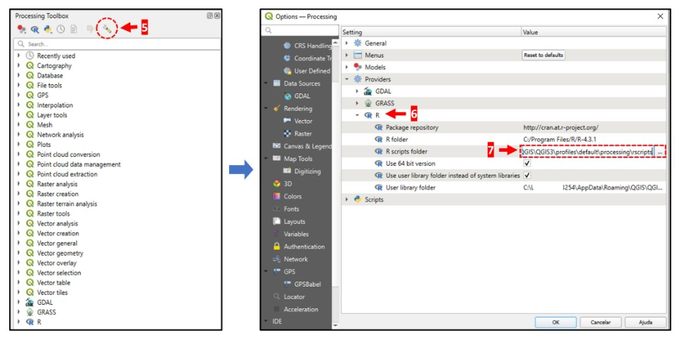

### Generating the Plot Shapefile
With FIELDimageR set up, you can now generate plot shapefiles from your
aerial imagery.

1. Load an image into QGIS. An RGB orthomosaic from a GRYFN drone is the
   easiest starting point.

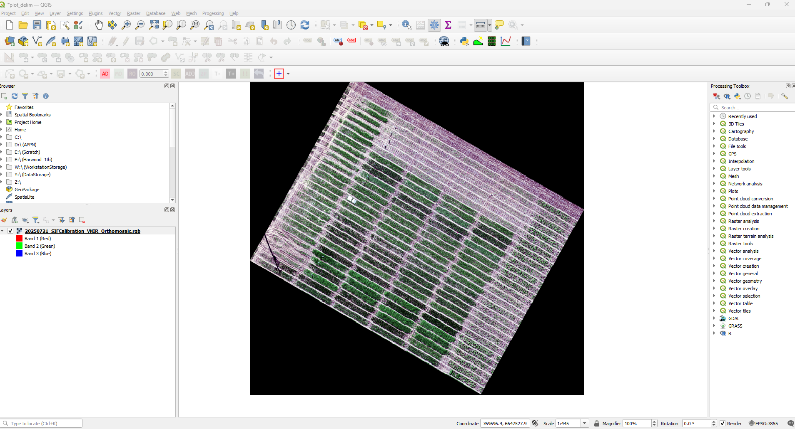

Now it’s important to inspect the plots and think about the plot boundaries. If we zoom into a plot and measure the width and the length we see the plot is ~ 10 meters by 1.5 meters. 

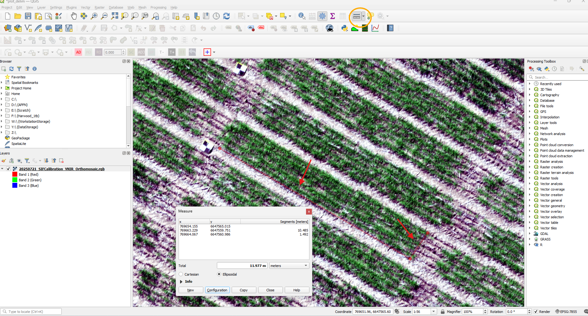
It has 5 rows (2 buffer rows, 3 rows we want to capture in our plant boundary)

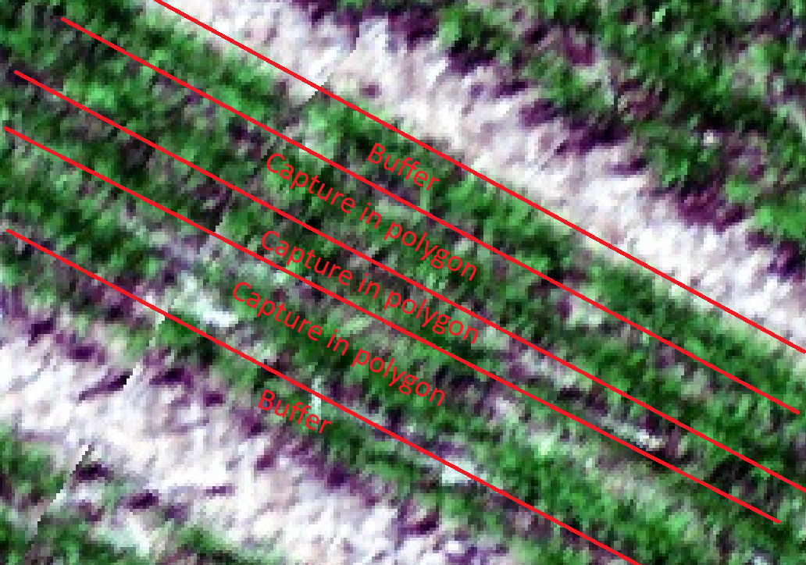
For this plot (2025 USYD Sif Calibration) we know that field techs are not taking any measurements from buffers, and we have been told to assume that there is and edge effect. Therefore, we follow these buffer guidelines: 

“APPN minimum buffer (working rule): 0.3 m from each plot end and 0.2 m from each plot side (across the drill direction), or the width of one row — whichever is larger.”

Some quick measurments shown below that 0.2 meters may still include some of the buffer, so here we will us "the width of one row"

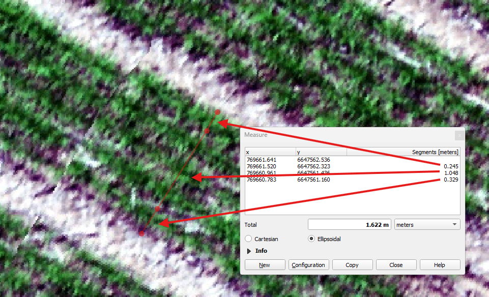

2. Open the **fieldShape** module from the Processing Toolbox.

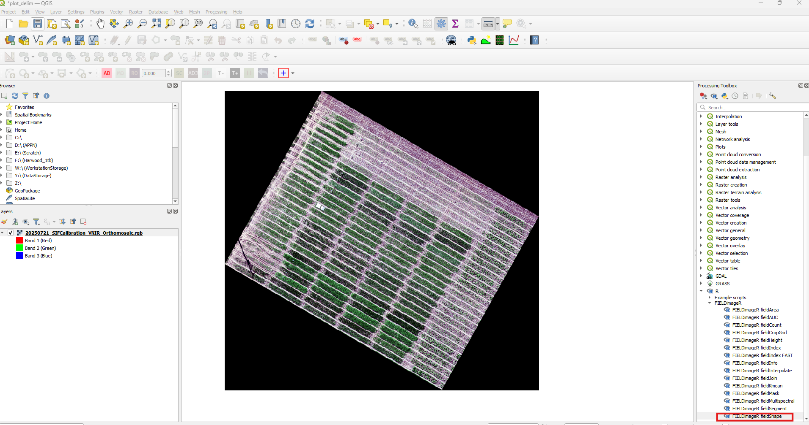

3. Fill in the module parameters:
   - Number of **rows** and **columns**.
   - The **corners** of the trial area (most critical for an accurate
     fit).
   - **Plot size**.
   - **Buffer** — essential for establishing a common analysis area by
     mitigating edge effects.
> [!NOTE]
> You can achieve fine plot delineation by playing with buffer or plot size and the corners. These methods have an element of trial and error in them and involve a lot of manual QC and tweaking.     

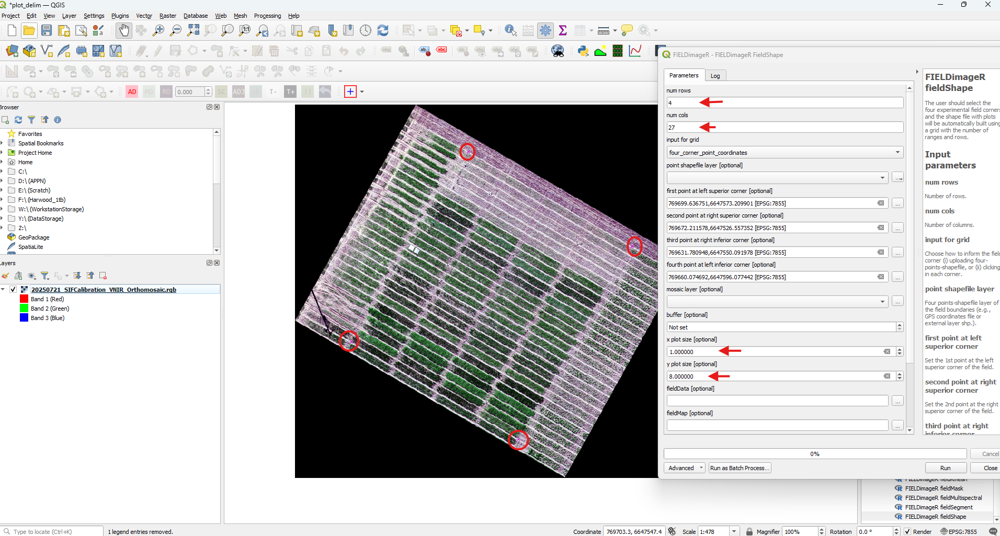


4. Click **Run**.

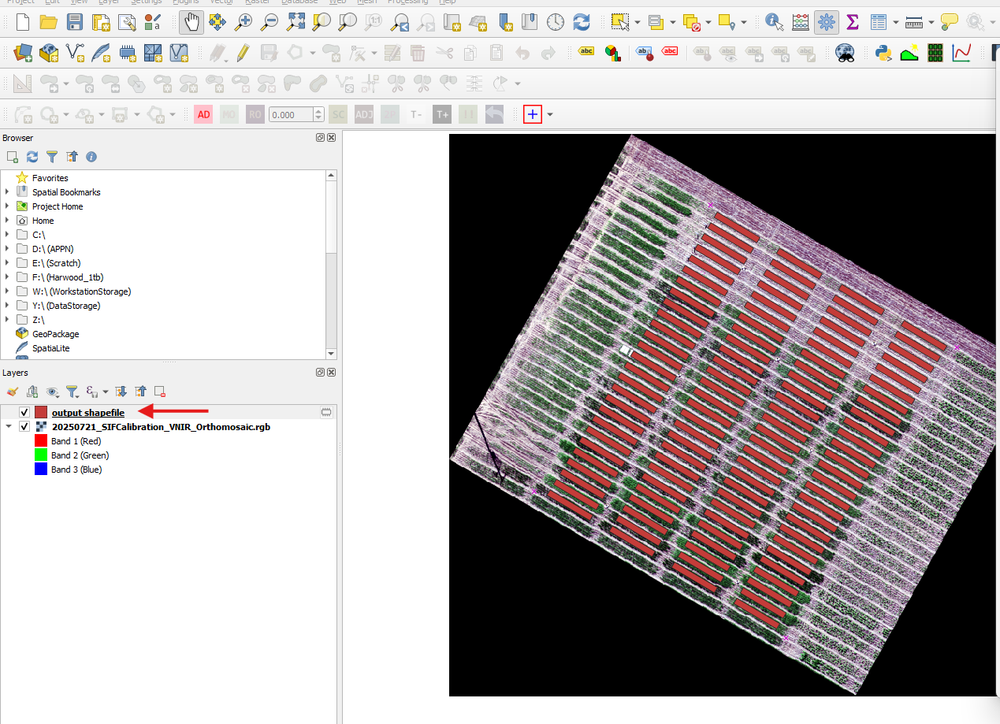

5. The plot shapefile will be generated.

It is now valuable to inspect the some plots and make sure that you are *mostly* not capturing any buffer rows. It’s likely some plots will not be perfect, that is fine, however as a rule of thumb you need to a clear chunk of plant material outside your plot segmentation. If in any plots your polygon captures the soil in between plots you must redo your plot delineation workflow 

Here is an zoomed in section from the workflow above, where the buffer rows are excluded.
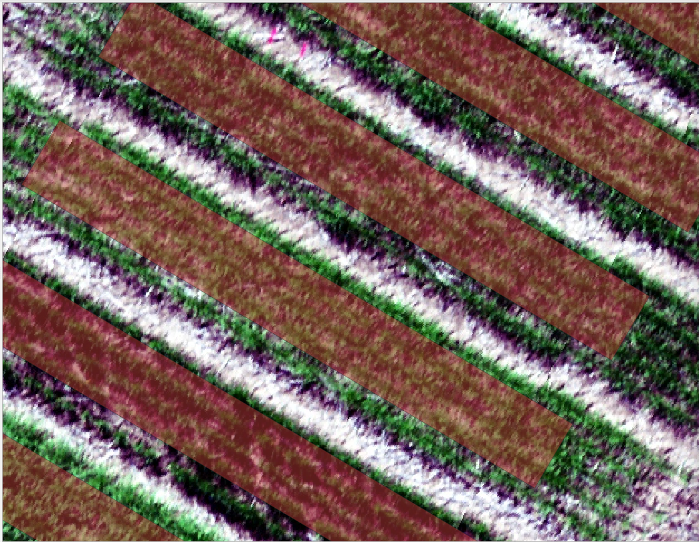

Here is a (bad) example from an early iteration of the workflow where the buffer rows and some soil are clearly included. 
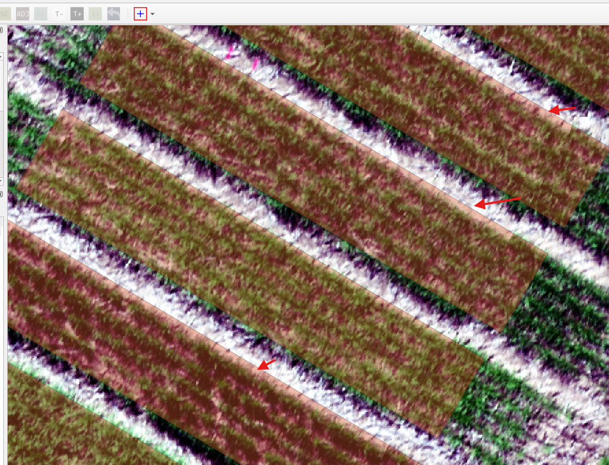


#### Save your settings

Save your fieldShape settings before closing the tool — inputs will be
wiped if FIELDimageR is closed.
#### Save your settings

Save your fieldShape settings before closing the tool — inputs will be
wiped if FIELDimageR is closed.
Use **Copy as JSON** and save the contents as a text file alongside the
shapefile in the trial's `Plot_Layout` directory.

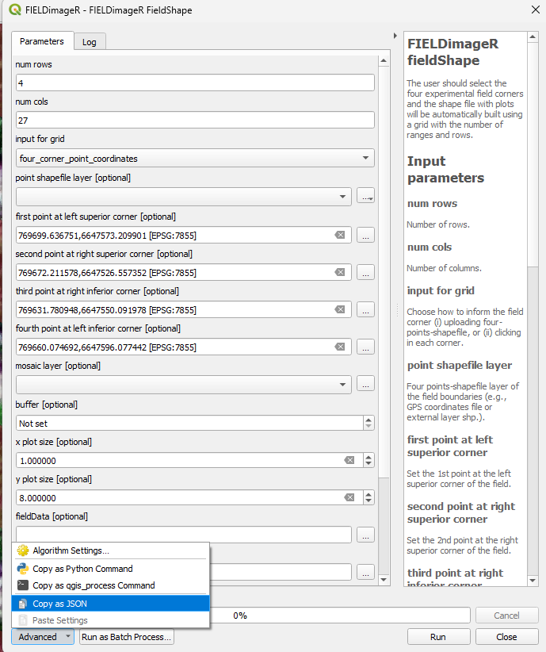
### Output

The shapefile produced by FIELDimageR contains plots identified only by
`fid`.


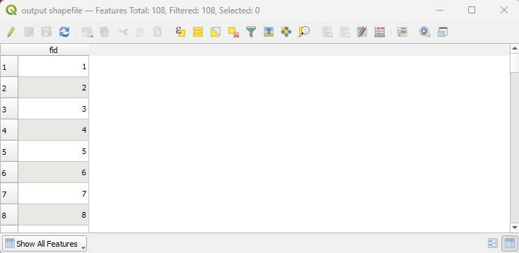

Attach trial metadata as described in
[Joining Trial Information](#joining-trial-information), then save the
final shapefile to the trial's `Plot_Layout` directory per the
[APPN Plot Shapefile Standard](#appn-plot-shapefile-standard).

---

## Method 2: DPIRD Field Mapping Tool

The DPIRD Field Mapping Tool is a desktop application for digitising and
managing agricultural field trial plot boundaries over drone orthomosaic
imagery. Built with [Streamlit](https://streamlit.io/) and Python
geospatial libraries, it runs locally in your web browser with no cloud
dependency.

Developed at the
[Department of Primary Industries and Regional Development (DPIRD)](https://www.dpird.wa.gov.au/),
Western Australia, as part of the
[Australian Plant Phenomics Network (APPN)](https://www.plantphenomics.org.au/).

### Features

- **Generate Grid** — Create regular plot grids over drone orthomosaics
  by drawing a trial boundary and specifying banks, rows, buffer, and
  plot dimensions. 
- **Edit Grid** — Interactive browser-based polygon editor with drag,
  vertex editing, multi-select, copy/paste, measurements, undo, and
  keyboard shortcuts.
- **Convert File** — Convert between Shapefile, GeoJSON, GeoPackage,
  and KML formats with optional CRS reprojection (GDA2020, GDA94,
  WGS 84, or custom EPSG).
- **Cropping Tool** — Crop rasters (orthophotos, DSMs, GeoTIFFs) to
  individual plot polygon boundaries, producing one file per plot.

All data is processed locally. No internet connection is required after
installation.

**Detailed installation instruction and documentation is provided in the [DPIRD Field Mapping Tool Documentation](https://github.com/appndpird/DPIRDFieldMappingTool/blob/main/DPIRD_Field_Mapping_Tool_Documentation.pdf) within the GitHub repository. Basic guidelines are provided below.**

### Software Installation

Go to the GitHub repository
[appndpird/DPIRDFieldMappingTool](https://github.com/appndpird/DPIRDFieldMappingTool)
and download the repository (click **Code → Download ZIP**, or
`git clone`). The repository contains two platform-specific
distributions — choose the one that matches your operating system.

#### Requirements

| | Windows | Linux / macOS |
|---|---|---|
| **OS** | Windows 10+ (64-bit) | Ubuntu 20.04+, Fedora, macOS 11+ |
| **Python** | Bundled via Miniconda | User-installed Anaconda/Miniconda |
| **Disk space** | ~2 GB | ~2 GB |
| **Internet** | First-time setup only | First-time setup only |

#### Windows

1. Extract `DPIRD_Field_Mapping_Tool_windows_v1.6.0`.
2. Place
   [`Miniconda3-latest-Windows-x86_64.exe`](https://repo.anaconda.com/miniconda/Miniconda3-latest-Windows-x86_64.exe)
   in the folder.
3. Double-click `Install_DPIRD_Tool.bat` and press `Y`.
4. Double-click `Run_DPIRD_Tool.bat` to launch.

#### Linux / macOS

1. Extract `DPIRD_Field_Mapping_Tool_linux_v1.6.0`.
2. Ensure [Anaconda or Miniconda](https://docs.anaconda.com/miniconda/)
   is installed.
3. Run:

   ```bash
   chmod +x install_dpird_tool.sh run_dpird_tool.sh
   ./install_dpird_tool.sh
   ./run_dpird_tool.sh
   ```

The tool opens in your browser at
[http://localhost:8501](http://localhost:8501).

### Generating the Plot Shapefile

1. Open the tool and navigate to the **Generate Grid** tab.

2. Enter your project folder path (the folder containing the
   orthomosaic `.tif` file). Click **Browse** or paste the path
   directly.

3. Select the orthomosaic file from the dropdown. Optionally select a
   CSV file to attach additional plot metadata.

4. Set the grid parameters:

   | Parameter | Description |
   |---|---|
   | **Banks** | Number of banks (columns) in the X direction. |
   | **Rows** | Number of rows in the Y direction within each bank. |
   | **Buffer (m)** | Gap between adjacent plots in metres. |
   | **Plot Size (W,H)** | Width and height of each plot in metres, comma-separated (e.g. `4,1`). |

5. Draw a boundary polygon on the map by clicking the four corners of
   the trial area in this order:

   **Top-left (B1R1) → Top-right (BXR1) → Bottom-right (BXRY) →
   Bottom-left (B1RY)**

   The first point defines the origin of the grid (plot B1R1). The
   orientation of the boundary polygon determines the rotation of the
   generated grid.

6. Click **Generate Grid**. Review the generated grid on the map and in
   the data table.

7. Fine-tune if needed — changing any grid parameter after generation
   automatically regenerates the grid using the same boundary.

8. Click **Save Initial Grid** to save as a shapefile.

#### Plot ID Convention

Plots are assigned IDs automatically:

| Field | Formula | Examples |
|---|---|---|
| `Plot_ID` | Bank × 1000 + Row | B1R1 = 1001, B2R3 = 2003 |
| `B/R` | Bank-Row label | B1R1, B2R3, B12R6 |
| `Bank` | Bank number | 1, 2, 3, … |
| `Row` | Row number | 1, 2, 3, … |

### Editing the Plot Shapefile

After generating (or loading an existing grid via the **Edit Grid**
tab), click **Edit Grid** to open the interactive browser-based polygon
editor in a new tab. The editor provides:

| Tool | Shortcut | Description |
|---|---|---|
| Navigate | `Esc` | Pan and zoom. Click a polygon to select it. |
| Drag Plots | `D` | Drag polygons to reposition. Ctrl/Cmd+Click to multi-select. |
| Edit Vertices | `V` | Drag individual corner vertices to reshape polygons. |
| Delete | `X` | Click a polygon to remove it. |
| Draw New | `N` | Click to place vertices; double-click to close. |
| Measurements | `M` | Toggle edge length labels (metres) on all polygons. |
| Copy / Paste | `Ctrl+C` / `Ctrl+V` | Duplicate selected polygons. |
| Undo | `Ctrl+Z` | Revert the last action (up to 50 steps). |
| Select All | `Ctrl+A` | Select all polygons. |

> [!NOTE]
> On macOS, use **Cmd** instead of **Ctrl** for all keyboard shortcuts.

Click **Save Shapefile** in the editor to write the edited grid to disk,
or **Export GeoJSON** to download a GeoJSON file.

### Converting Vector Data File Formats

Use the **Convert File** tab to convert the output shapefile to GeoJSON or reproject to a different CRS:

1. Load the shapefile via **Browse Input File**.
2. Set the output format to **GeoJSON**.
3. Select the target CRS (typically the CRS of the source orthomosaic,
   e.g. GDA2020 / MGA Zone 50).
4. Click **Convert & Save**.

### Cropping Rasters to Plots

Use the **Cropping Tool** tab to crop the orthomosaic (or DSM) to
individual plot boundaries:

1. Load the plot shapefile and the raster file.
2. Choose a save folder and base filename.
3. Click **Crop and Save**.

For a grid with multiple polygons, one raster is saved per plot (e.g.
`cropped_1001.tif`, `cropped_2003.tif`). The tool automatically
reprojects the vector to match the raster's CRS if they differ.

### Output

The shapefile produced by the DPIRD Field Mapping Tool contains plots
identified by `Plot_ID` (Bank × 1000 + Row), `B/R`, `Bank`, and `Row`.
To produce an APPN-compliant plot shapefile:

1. **Rename** `Plot_ID` to `plot_id` (or add a `plot_id` column mapped
   from `Plot_ID`) to match the
   [Required attributes](#required-attributes) specification.
2. **Add** an `fid` column if not already present (sequential polygon
   identifier).
3. **Convert** to GeoJSON using the Convert File tab if the primary
   deliverable should be `.geojson`.
4. Attach trial metadata as described in
[Joining Trial Information](#joining-trial-information), then save the
final file to the trial's `Plot_Layout` directory per the
[APPN Plot Shapefile Standard](#appn-plot-shapefile-standard).

### Further Documentation

Detailed installation instruction and documentation: [DPIRD Field Mapping Tool Documentation](https://github.com/appndpird/DPIRDFieldMappingTool/blob/main/DPIRD_Field_Mapping_Tool_Documentation.pdf).

---

## Method 3: GPT plot creation tool

The GRYFN Plot Extraction Tool is software that automatically generates
plot boundary files for agricultural research trials. This procedure
describes the complete workflow from project creation to final GeoJSON
export.

Official wiki:
[https://gryfn.gitbook.io/gryfn-software/gryfn-plot-extraction-tool](https://gryfn.gitbook.io/gryfn-software/gryfn-plot-extraction-tool).

### Step 1 — Install the Software

Download and install the GRYFN Plot Extraction Tool from the official
website. The licence is required from GRYFN.

### Step 2 — Create a New Project

Click **New Project**. A new window will open. Complete the following
fields:

- **Output prefix:** Enter a project name.
- **Output path:** Define the folder where outputs will be saved. For
  example:
  `Q:\Adelaide\2025_SIFOzBarley\Roseworthy\Documentation\Plot_Layout`
- **Image layers:** Add one or more image layers. Supported types
  include LiDAR DSM, high-resolution RGB mosaic, VNIR orthomosaic, and
  SWIR orthomosaic.
- **Base map:** Select one layer as the base map. The VNIR orthomosaic
  is recommended due to its smaller file size. Click **Load**.
- **Extent:** Click **Create**. A polygon with four corners will appear
  on the map. Click and drag each corner to define the site boundary.

> [!NOTE]
> Right-click the map to pan, and scroll the mouse wheel to zoom in and
> out.

- **Field name:** Enter a name for the field.
- **Unit:** Ensure this is set to **Metric**.
- **Plot dimensions:** Enter the range count, row count, plot length,
  and plot width.
- **Segments per Plot:** If plots contain two or more treatment zones,
  enter the number of segments. Otherwise, leave it as default: `1`.

Click **OK** to close the window, then click **Open Project** to load
the YAML project file you just created.

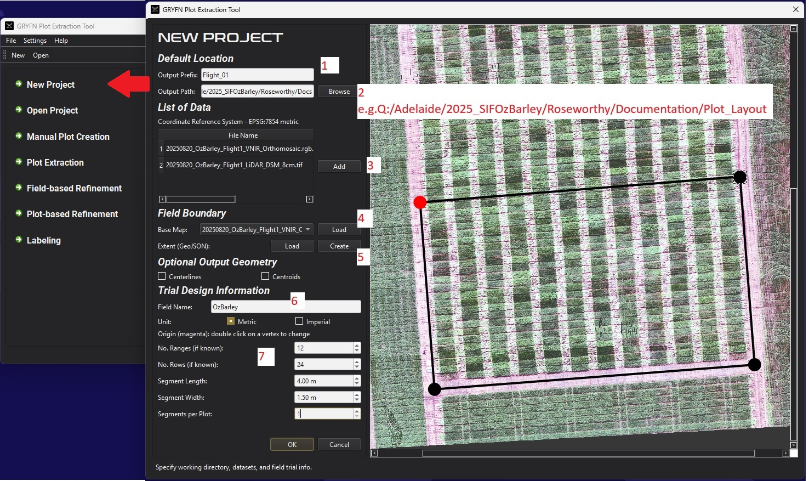

### Step 3 — Create the Plots

There are two methods for creating plots: manual and automatic. Both
are described below. Choose the method that best suits your data and
field conditions.

#### Option A — Manual Plot Creation

This method creates plots with a uniform size and spacing. It is best
suited for uniformly planted trials with accurately captured
orthomosaic imagery.

- Click **Manual Plot Creation** in the GRYFN Plot Extraction Tool.
- Load the base map (e.g. VNIR orthomosaic) and click **Load**. The map
  will display with a set of slim plot polygons overlaid, which will
  need to be adjusted.
- **Plot dimensions:** Enter the plot length and width. Apply standard
  buffer values (e.g. a 4 m × 1.5 m plot uses a 3.4 m × 1.1 m analysis
  area).
- **Gap size:** Enter the gap between plots with the appropriate buffer
  added. Examples:
  - Range gap of 2 m: gap = 2 + 0.3 + 0.3 = 2.6 m
  - Row gap of 0.2 m: gap = 0.2 + 0.4 + 0.4 = 1.0 m
- **Rotation:** Enter a rotation angle to align the plot grid with the
  map. Use the up and down arrow keys for fine adjustments.
- **Position:** Use the **Move**, **Up**, **Down**, **Left**, and
  **Right** controls to align the plot grid with the map.
- Once the plot locations are satisfactory, click **Export Plots**,
  then click **OK**.

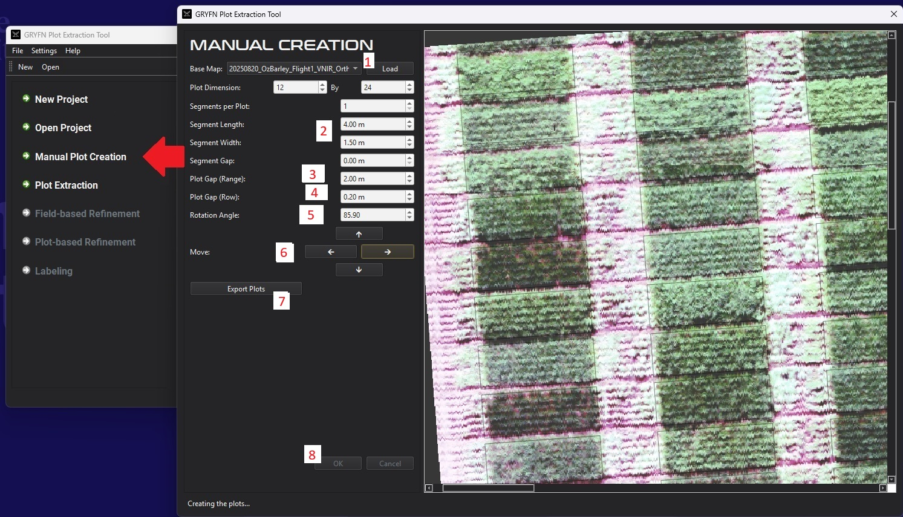

> [!NOTE]
> Minor manual adjustment in QGIS or ArcGIS may be required after
> export. Not all plots are perfectly planted, and GPS drift between
> flight lines during image collection can introduce small positional
> offsets.

#### Option B — Automatic Plot Extraction

This method detects plot boundaries automatically using vegetation
indices and gap detection.

- Click **Plot Extraction** in the GRYFN Plot Extraction Tool.
- Select the VNIR Orthomosaic as the map and click **Load**.
- Use the default values for detection cell size and click **OK**.
- Select a vegetation index for detection. Both GLI and NGRDI generally
  produce reliable results.
- A map rotated to vertical or horizontal orientation will appear.
  Based on the rotation applied, select whether the row direction is
  vertical or horizontal. Select **Gaps** as the row detection option.
- **Minimum spacing:** Enter the minimum plot dimension (e.g. for a
  1.5 m row, enter 1.4 m to avoid missed detections).
- Click **Detect Rows/Alleys**. A grid will appear on the map.

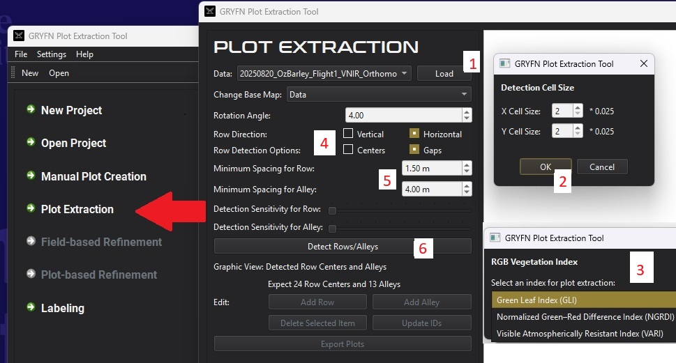

- Verify that the correct number of rows and alleys are present. Extra
  rows or alleys at the edges can be removed by selecting them and
  clicking **Delete Selected Item**. Missing lines can be added and
  dragged to the correct position.


- Click **Export Plots**, then click **OK**.
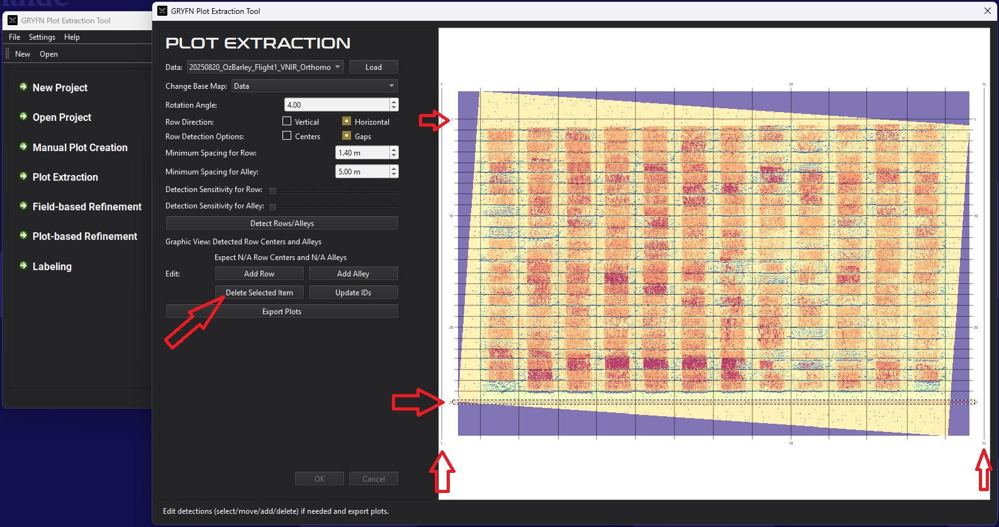


#### Plot-Based Refinement (Automatic Method Only)

After automatic extraction, an additional refinement step is required:

- Click **Plot-based Refinement** in the GRYFN Plot Extraction Tool.
- Load the map and select a vegetation index.
- Load the input plot file from:
  `project_name\plot_extraction\project_name_plots_for_refinement.geojson`
- Enter the segment width and length, using standard buffer values.
- Click **Refine and Export**.
- Review the output plots to confirm no plots are missing or
  incorrectly positioned, then click **OK**.

  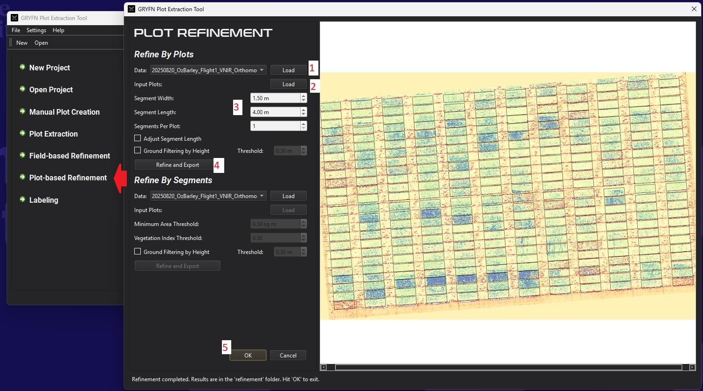

### Step 4 — Label the Plots

Click **Labeling** in the GRYFN Plot Extraction Tool and complete the
following steps:

- Load the map and click **Load**.
- Load the GeoJSON file created in the previous step:
  - Manual method:
    `project_name\manual_creation\project_name_plots_manual`
  - Automatic method:
    `project_name\plot_refinement\project_name_RP-plots`
- Select the plot origin (Range 1, Row 1) by choosing position 1, 2,
  3, or 4 as shown on the map.


- Click **Label**, then **Export**, then **OK**.

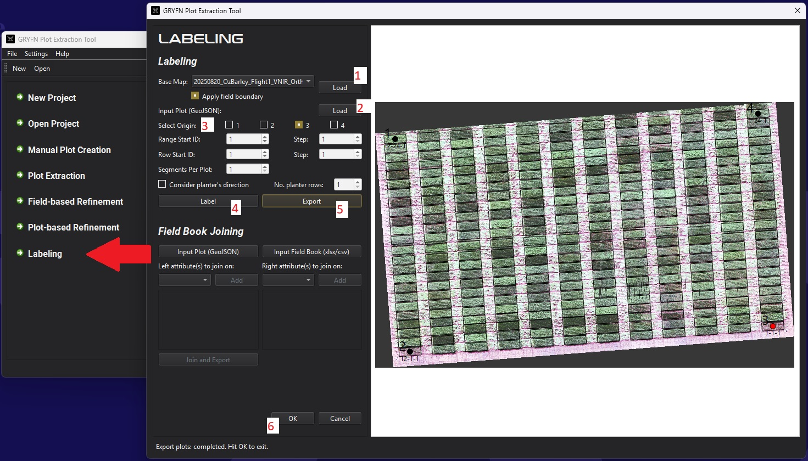


### Step 5 — Add `fid` and `plot_id` Columns in QGIS

The final step adds two calculated attribute columns to the GeoJSON
file using QGIS.

- Open the GeoJSON file in QGIS.
- Right-click the layer in the **Layers** panel and select **Open
  Attribute Table**.
- Click the pencil icon (top left of the table) to enable editing.
- Click the calculator icon to open the **Field Calculator**.

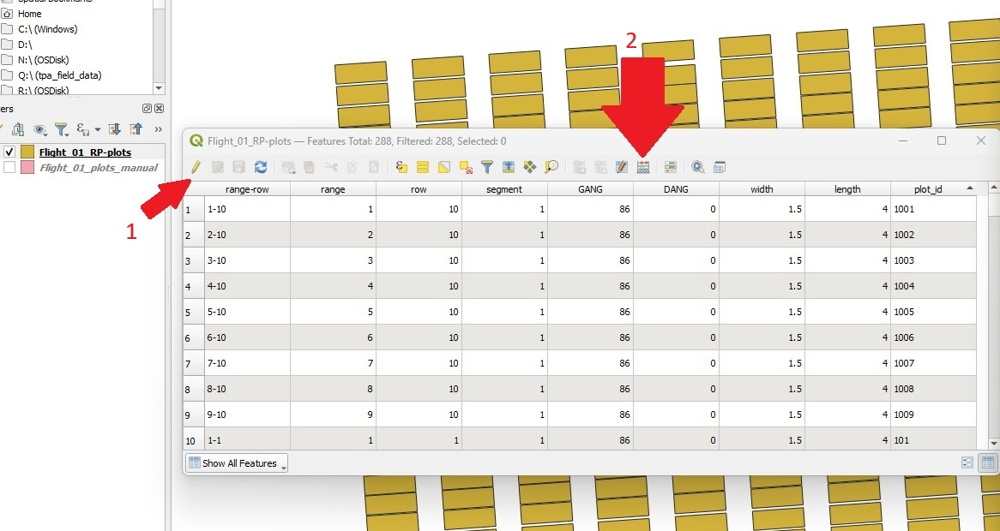

Add the `fid` column:

- **Output field name:** `fid`
- **Expression:** `$id + 1`
- Click **Apply**, then **OK**.

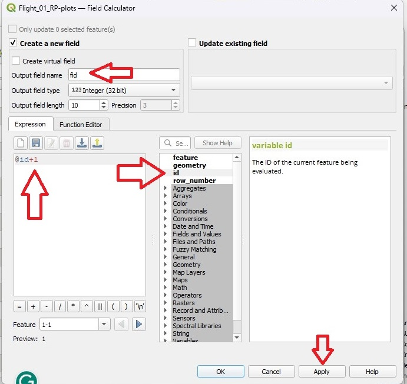

Add the `plot_id` column:

- **Output field name:** `plot_id`
- **Expression:** `row * 100 + range`
- Click **Apply**, then **OK**.


- Click the **Save** button (or press `Ctrl+S`) to save the edits.

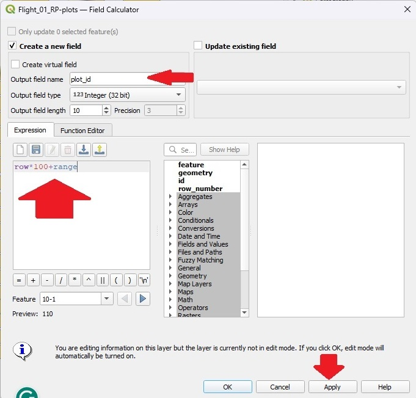

> [!NOTE]
> Additional plot delineation methods will be documented here as they
> are adopted by APPN.

---

---
